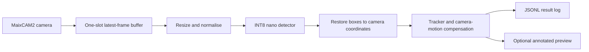

# Building a cheap drone that can detect and track objects

*A first-principles account of how an efficient onboard detection-and-tracking
system will work.*

*Project direction updated 31 August 2026.*

## The project in plain English

I want a drone to look through its own camera, find ordinary objects such as
people, bicycles, cars, vans, trucks, and buses, and keep track of each one as
the drone and the objects move.

The important constraint is cost. It is easy to run a large vision model on a
desktop graphics card. The interesting engineering question is how much useful
perception can be put onto the cheapest computer that can actually fly as part
of a small drone payload.

The first working version will not fly itself. A person will pilot the drone.
The onboard vision computer will process the live camera stream, attach boxes
and stable numbers to visible objects, and save everything for later
measurement. Flight stabilisation and failsafes remain in the normal flight
controller.

That boundary makes the project achievable and honest. “It ran on a drone” will
mean the images were processed by hardware carried and powered by the aircraft,
not sent to a laptop or cloud service. It will not imply autonomous pursuit or
navigation.

## Detection, from first principles

An image classifier gives one answer for an image. An object detector gives a
set of answers. Each answer contains:

- a class, such as `car` or `pedestrian`;
- a confidence score; and
- a rectangle around the object.

The rectangle is usually written as four numbers:

```text
(left, top, right, bottom)
```

This project divides each coordinate by the image width or height, so every
coordinate lies between zero and one. A box remains meaningful when a preview
is resized, and the interface is not tied to one camera resolution.

A modern detector is a neural network trained from examples of images and
boxes. Early layers respond to local patterns such as edges and corners. Later
layers combine those patterns into larger visual features. Several output
scales matter because a nearby bus may occupy half the frame while a distant
pedestrian may be only a few pixels wide.

Training adjusts the network so that its predicted classes and boxes approach
the examples. At runtime the adjustments stop. A camera frame goes in, arrays
of numbers flow through the fixed network, and boxes come out.

## Tracking, from first principles

Detection treats every frame independently. If a car is box number four in one
frame and box number seven in the next, detection alone does not know that both
boxes describe the same car.

A tracker maintains that missing piece of state. It predicts where each recent
object is likely to appear, compares predictions with the new detections, and
assigns stable IDs:

```text
car #12 -> frame 101 -> frame 102 -> frame 103
```

The first baseline is ByteTrack. Many trackers immediately discard boxes below
a confidence threshold. ByteTrack also considers lower-confidence boxes when
matching them to existing tracks. This can preserve an ID while an object is
partly hidden, blurred, or temporarily difficult to see. The method is simple
enough to run beside a small detector without another large neural network.

A drone creates a special problem: the camera moves. When the aircraft turns,
nearly every pixel shifts even if the objects on the ground are stationary.
BoT-SORT adds camera-motion compensation, which estimates this background
movement before matching objects. I will compare it with ByteTrack on real
moving-camera sequences, initially with its heavier appearance-recognition
network switched off.

Tracking does not rescue a detector that never sees an object. It can bridge
brief gaps and make motion coherent, but the detector still determines what can
enter a track.

## Why aerial images are hard

A model trained on street-level photos often sees large people and cars from
the side. A drone sees roofs, heads, shadows, road markings, and a great deal of
background. Altitude changes object size dramatically. Motion, vibration, haze,
compression, and a rolling camera shutter remove still more detail.

The UAVDT benchmark gives a useful scale example: at high altitude, a vehicle
can occupy about 0.005% of a frame. Downscaling the frame may reduce an already
small target to a handful of pixels. Once the resize erases those pixels, a
clever network cannot recreate the missing evidence.

This creates the central trade-off:

```text
higher input resolution -> more small-object detail -> more computation
lower input resolution  -> less computation          -> more missed objects
```

That is why the project will not advertise speed without stating the input
size. “30 frames per second” at 320 pixels and at 640 pixels are different
systems.

## The public data foundation

The main dataset is VisDrone. Its official release contains 10,209 static
images and 288 video clips containing 261,908 frames, captured across 14 cities
with different drone platforms, lighting, weather, scene density, and viewing
conditions. More than 2.6 million boxes annotate people, vehicles, bicycles,
and related road users.

VisDrone is useful because it supports both halves of the project:

- its detection set teaches and measures boxes in individual images;
- its video and multi-object-tracking sets teach or measure continuity and
  identity across frames.

The first vocabulary keeps the ten native VisDrone categories: pedestrian,
person, bicycle, car, van, truck, tricycle, awning-tricycle, bus, and motor.
Keeping the native category order avoids ambiguous relabelling during the first
implementation.

UAVDT is a second test domain. It contains about 80,000 annotated frames from
100 aerial video sequences and focuses on vehicles under different altitudes,
views, weather, and occlusion. A model that works on VisDrone but collapses on
UAVDT has probably learned one benchmark more than it has learned aerial
vision.

The project will record every source, original image or sequence ID, hash, and
annotation conversion. Adjacent frames from one video stay in the same split.
Putting frame 100 into training and frame 101 into validation would give the
model an almost duplicated exam question.

Licensing is not being used as an MVP blocker. Source provenance will still be
kept because publishing raw data or trained weights later is a separate decision
from using public research data during development.

## Starting from a public model

Training a detector from random numbers wastes data and compute. Public models
trained on COCO already understand a broad set of visual features. Fine-tuning
starts from those weights and makes smaller adjustments for aerial viewpoints
and the VisDrone classes.

The planned baseline is the nano-sized public YOLO26 checkpoint. It is not
chosen because “latest” guarantees “best.” It is chosen because the current
toolchain connects the entire path needed for this MVP:

- public pretrained weights;
- ordinary detector fine-tuning;
- multi-object trackers;
- static ONNX export;
- INT8 calibration;
- static ONNX export and MaixCAM2 conversion paths; and
- end-to-end detection outputs that reduce post-processing work.

The package version and model hash will be frozen. If YOLO26n fails to compile
through Pulsar2/MaixHub after three documented attempts, YOLO11n is the
fallback at the same input size. A model that is two points better on a paper
but cannot run on the aircraft is not better for this project.

## What current research contributes

The MVP uses established components, but current research tells us where the
largest efficiency gains are likely to be.

YOLOv10 showed that a detector can remove conventional non-maximum suppression
from its critical path and improve the latency/accuracy balance. That supports
using an end-to-end nano detector when the device runtime implements it well.

SAHI divides a large image into overlapping slices and runs a detector on each
slice. Its paper reported sizeable average-precision gains on VisDrone and
xView, particularly for small objects. The price is obvious: four tiles require
roughly four detector passes before overlap. The sensible onboard use is a
scheduled or uncertainty-triggered scan, not permanent tiling of every frame.

EDNet and other recent aerial-specific detectors add extra small-object output
heads and better cross-scale feature fusion. They are promising if the ordinary
nano baseline misses distant targets. They are not the starting point because
special layers and operators can make accelerator conversion harder.

Research on aerial detector distillation is also relevant. Distillation belongs
after a good detector works, not before. A compact model must preserve both
classification and localisation, and it must be measured on the final device.

Event cameras and event-driven networks can save energy and represent rapid
motion without conventional frame blur. They require different sensors, data,
and processing, so they are a future research branch rather than an MVP
dependency.

## The onboard computer

An ESP32-class microcontroller is attractive because it is cheap and low power,
but it does not provide a credible first target for a multi-scale detector
operating on enough pixels to see distant aerial objects.

The flight target is MaixCAM2 (Axera AX630C), carried as the perception payload
on a self-assembled approximately 7-inch quadcopter. It integrates the camera,
Linux system, NPU, storage, and M12 lens, which avoids treating a separate
companion computer and CSI camera as the aircraft default. The flight
controller still flies the aircraft; MaixCAM2 only perceives and logs.

This target has three decisive advantages:

1. one physical camera/NPU/Linux payload to power and mount;
2. a direct static-ONNX-to-INT8 `.axmodel` path; and
3. a small enough package to measure on the aircraft before adding other
   compute boards.

Pi/Hailo, Luckfox, and desktop INT8 systems are optional reference platforms
after the MaixCAM2 flight path works. Vendor model-only throughput remains a
hint, not a capture-to-track-result measurement.

## How the software will fit together



The one-slot frame buffer is an important design choice. If inference becomes
slower than the camera, an ordinary queue grows. The system may then be drawing
perfect boxes around what the camera saw several seconds ago. A latest-frame
buffer overwrites old work. Some frames are skipped, but latency stays bounded.

Capture timestamps travel with the frame. The tracker uses those timestamps,
not the time at which inference happens. Every output records whether it came
from a fresh detection or a prediction carried between detector updates.

Preview rendering and video compression are optional paths. They must not block
the detector. The machine-readable log is the authoritative result.

## How computation will be saved

The first optimisation is to use a nano detector with a batch size of one and a
hardware-native INT8 representation. INT8 uses small integer operations where
the training model normally uses larger floating-point numbers. Calibration
shows the converter representative aerial images so it can choose useful
numeric ranges. Accuracy before and after conversion must be compared; “INT8”
is not automatically free performance.

The second optimisation is to test resolution rather than guess. The same
validation sequences will run at 640, about 512 or 480, 416, and 320 pixels.
For each size I will record accuracy for small objects, latency, and power.

The third optimisation is temporal. A camera may capture 30 frames per second
while the detector runs 10 or 15 times per second. A cheap Kalman motion model
can propagate tracks between fresh detections. Each propagated result keeps an
age, so downstream code cannot confuse prediction with observation.

The fourth optimisation is selective high resolution. A full-frame pass runs
normally. An overlapping 2x2 scan can run occasionally or when the normal path
has low confidence. This spends extra computation when it is most likely to
recover a tiny object.

The fifth optimisation is subtraction: turn off preview, encoding, appearance
re-identification, and high-rate telemetry unless measurements show they are
needed. Removing work is usually safer than adding a more complicated model.

## How success will be measured

Detection accuracy is not one percentage. The main score, `mAP50-95`, tests
whether predicted boxes have the correct class and overlap the real boxes at a
range of strictness levels. `AP_small` isolates small objects, the project’s
hardest case. Per-class recall reveals whether a good average is hiding a class
that is almost never detected.

Tracking needs separate measures. IDF1 rewards correct object identities across
time. HOTA combines detection and association quality. Identity switches count
times when one real object changes its assigned number. Fragmentation counts
tracks that repeatedly disappear and restart.

System measurements matter just as much:

- p50 and p95 time from camera capture to track result;
- detector updates and camera frames per second;
- overwritten or dropped frames;
- memory, temperature, and throttling;
- average and peak electrical power;
- model and runtime storage;
- total payload mass; and
- actual compute, camera, storage, cooling, regulator, and cable cost.

All performance numbers will state image size, numeric precision, device,
pipeline boundary, and test duration. A vendor’s neural-network benchmark is a
useful hint, not a project result.

## The step-by-step build

The shortest working sequence is:

1. Freeze the detection vocabulary and versioned box/track contracts.
2. Run the untouched public nano checkpoint on a few aerial images and a short
   video before training anything.
3. Convert VisDrone and UAVDT through reproducible manifests, keeping full video
   sequences in one split.
4. Fine-tune the public model on VisDrone and prove that it beats the untouched
   checkpoint, especially on small objects.
5. Compare ByteTrack and a camera-motion-compensated tracker on held-out aerial
   video.
6. Measure resolution, detector cadence, and selective tiling to choose an
   accuracy/speed operating point.
7. export and calibrate the detector to INT8, then compare boxes against the
   desktop model.
8. Export to MaixCAM2 INT8 `.axmodel`, compare boxes against the desktop model,
   and run its bounded live-camera pipeline.
9. Complete the 7-inch payload safety ladder, then a short piloted,
   recording-only flight.
10. Optionally repeat the benchmark on Pi/Hailo, Luckfox, or desktop INT8 as a
    reference comparison.

The detailed gates and test cases live in
[`implementation_plan_v2.md`](implementation_plan_v2.md).

## What the first flight will and will not prove

A successful first flight will prove that the camera, detector, tracker,
accelerator, power supply, cooling, storage, and logging operate together while
carried by the aircraft. It will produce real vibration, motion blur, altitude,
and lighting evidence that no desktop benchmark provides.

It will not prove safe autonomous target following. It will not prove that the
model works in every place or weather condition. It will not identify people.
It will not make a benchmark score a safety certificate.

Those limits are strengths. They make the MVP small enough to finish and its
claims easy to verify.

## The research question

The central research question is:

> What is the cheapest onboard computer that can maintain useful detection and
> track quality in aerial video, and how much accuracy is lost for each dollar,
> watt, and gram removed?

That question produces something practical and something worth studying. The
practical output is a working drone-mounted detector and tracker. The research
output is a measured efficiency frontier rather than a single attractive demo.

## References

- [VisDrone official dataset repository](https://github.com/VisDrone/VisDrone-Dataset)
- [UAVDT official benchmark](https://sites.google.com/view/grli-uavdt/)
- [YOLOv10: Real-Time End-to-End Object Detection](https://arxiv.org/abs/2405.14458)
- [SAHI: Slicing Aided Hyper Inference](https://arxiv.org/abs/2202.06934)
- [ByteTrack](https://arxiv.org/abs/2110.06864)
- [BoT-SORT](https://arxiv.org/abs/2206.14651)
- [EDNet: edge-optimised small-target detection in UAV imagery](https://arxiv.org/abs/2501.05885)
- [Ultralytics object-tracking documentation](https://docs.ultralytics.com/modes/track/)
- [Ultralytics export and INT8 documentation](https://docs.ultralytics.com/modes/export/)
- [MaixCAM2 specifications](https://wiki.sipeed.com/hardware/en/maixcam/maixcam2.html)
