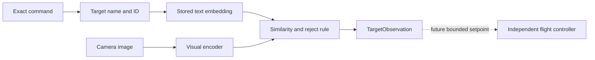

# Building µAeroVLM: teaching a tiny vision system to understand a drone command

*A first-principles account of the design, dataset, experiments, results, and
failures behind the first desktop prototype.*

*Experiments run 28 August 2026.*

## What I built

µAeroVLM is an experiment in making language-guided computer vision small
enough to eventually run on a low-cost, low-power drone computer.

The long-term idea is simple to describe. A person gives a command such as
`FIND bicycle`. A camera looks at the scene. The onboard system decides whether
the requested object is visible and, later, where it is in the image. A separate
flight controller would then turn that observation into safe aircraft motion.

The current build is deliberately earlier and narrower than that final goal. It
contains:

1. A strict command language with three actions and ten object names.
2. A licensed, reproducible image dataset with 1,141 scenes.
3. A large desktop “teacher” model that connects images and object names.
4. An explicit rule for saying “none of the targets are visible”.
5. A compact 478,112-parameter visual “student” model trained to imitate the
   teacher's image representation.
6. A static ONNX export, which is a portable model file intended for later
   deployment experiments.
7. Tests and experiment records that keep the measurements traceable.

This is not yet a flying autonomous drone, and it is not a general-purpose
vision-language model running onboard. The teacher works well on the assembled
desktop dataset. The compact student learns useful target information, but its
empty-scene rejection fails. That failure is the most important result of the
current phase.

## The problem from first principles

A normal image classifier chooses from a fixed list: bicycle, bottle, vehicle,
and so on. A vision-language model instead places images and phrases into the
same mathematical space. In that space, an image of a bicycle should sit closer
to the phrase “a photo of a bicycle” than to “a photo of a water bottle”.

The model represents each image or phrase as a list of numbers called an
**embedding**. You can think of an embedding as a coordinate on a map of visual
meaning. Similar images and phrases should land in similar parts of the map.

To compare two embeddings, I use cosine similarity. This asks whether the two
number lists point in the same direction:

```text
similarity = image embedding · text embedding
```

The embeddings are first scaled to length one. Their dot product then becomes
the cosine similarity. A higher score means the image and phrase are a better
semantic match.

This approach is useful for the project because the object names remain outside
the visual model. A command can select a stored text embedding, and the camera
model can compare its image embedding with that target. The system does not need
to run a language generator on every video frame.

The difficulty is size. A capable desktop teacher is too large for the class of
microcontroller being considered. The research question is therefore not “Can
a large model recognise a bicycle?” It is:

> How much of the teacher's useful image-and-language behaviour can a very small
> visual model retain, and what breaks when it is compressed?

## Why the command language is intentionally small

The project begins at language level L1: a bounded grammar interpreted locally.
It accepts exactly three actions:

- `FIND`
- `APPROACH`
- `HOLD`

Each action is followed by one exact object name. `APPROACH` may also include a
positive distance in metres. Examples are:

```text
FIND bicycle
APPROACH water bottle 2.5
HOLD black vehicle
```

Capitalisation and spacing are intentional. `FIND bicycle` is valid;
`find bicycle`, `FIND  bicycle`, and `FIND bike` are rejected.

This strictness is a safety and testability choice. A generative language model
can interpret many phrasings, but it can also misunderstand them in ways that
are hard to enumerate. The exact parser has a small, inspectable set of outcomes.
It either returns a structured command or one of three errors: malformed input,
unknown target, or unsupported action.

Every accepted command contains a stable target ID as well as its text name.
The ten frozen names are:

| ID | Name |
|---:|---|
| 1 | red backpack |
| 2 | water bottle |
| 3 | person in high-vis |
| 4 | black vehicle |
| 5 | solar panel |
| 6 | wheelie bin |
| 7 | bicycle |
| 8 | cardboard box |
| 9 | sports ball |
| 10 | orange bucket |

Freezing the vocabulary prevents the dataset, model, parser, and metrics from
quietly using different names. It also exposes a problem in the original list:
several names include colour or material claims that the source annotations do
not prove. I kept the names for compatibility, documented the mismatch, and
reduced the supported mission scope instead of relabelling the evidence.

## The system boundary

The design separates language, perception, and flight control:



The current software stops at `TargetObservation`. An observation says whether
a target is visible, gives a similarity-based confidence, carries a timestamp,
and may contain normalised image coordinates. When no target is accepted, its
label and ID are null. A stale observation is not supposed to be reused
indefinitely.

The teacher currently performs whole-image classification, so its temporary
location is the entire frame: centre `(0.5, 0.5)` and box `(0, 0, 1, 1)`. Real
object localisation is a later phase.

The AI side is never intended to command individual motors. Stabilisation,
arming, motor output, pilot override, and aircraft failsafes belong to an
independent flight controller. That boundary limits how directly a perception
mistake can destabilise an aircraft.

## Building the image dataset

### Source choice

I used public datasets with explicit licence information rather than image
search results or scraped web pages. Most images came from the official Open
Images V7 validation data. The high-visibility-person examples came from the
Construction Site Safety Dataset, licensed CC BY 4.0.

The source mapping was:

| Project name | Public source annotation |
|---|---|
| red backpack | Open Images `Backpack` |
| water bottle | Open Images `Bottle` |
| person in high-vis | safety vest and person annotations |
| black vehicle | Open Images `Car`, `Truck`, and `Van` |
| solar panel | Open Images `Solar panel` |
| wheelie bin | Open Images `Waste container` |
| bicycle | Open Images `Bicycle` |
| cardboard box | Open Images `Box` |
| sports ball | Open Images `Ball` |
| orange bucket | Open Images `Bucket` |

Open Images stores licence information per image. The manifest retains each
source URL, licence, original identifier, and image hash. Raw images are not
stored in version control.

### What the labels do and do not prove

The mapping is useful but imperfect:

- `Backpack` does not prove that the backpack is red.
- `Car`, `Truck`, or `Van` does not prove that the vehicle is black.
- `Bucket` does not prove that the bucket is orange.
- `Box` does not prove that the box is cardboard.
- `Bottle`, `Waste container`, and `Ball` are broader than their project names.

These are label-noise problems. The correct response is to disclose them and
collect better evidence later, not to pretend the adjectives were verified.

### Selection and schema

The assembly process downloaded subsets only. It capped each target near 200
images and selected 300 `no_target` scenes. A target image was kept only when
the available mapped annotations did not identify a second project target in
the same scene. Where source boxes existed, multiple boxes for the same target
were combined into one normalised box.

`no_target` is not an eleventh object class. It is a frame-level flag meaning
that none of the mapped source classes appeared in the available positive
annotations. This is not proof that every possible target is absent; it is the
strongest reproducible statement supported by the source annotations.

Each manifest row contains:

- the local image path and SHA-256 content hash;
- source, source ID, scene/session ID, and source URL;
- split and licence;
- exact project label and numeric ID, or the `no_target` flag;
- an optional normalised bounding box; and
- an explicit `colour_verified` field, false for this dataset.

Splitting by scene/source ID prevents two versions of the same scene from being
placed on opposite sides of an evaluation.

### Actual class balance

The final Phase 1 manifest contained 1,141 validation scenes:

| Ground truth | Images |
|---|---:|
| red backpack | 20 |
| water bottle | 167 |
| person in high-vis | 2 |
| black vehicle | 200 |
| solar panel | 14 |
| wheelie bin | 17 |
| bicycle | 195 |
| cardboard box | 57 |
| sports ball | 158 |
| orange bucket | 11 |
| no target | 300 |

The imbalance matters. A perfect result on two high-visibility-person images
does not show that the system will generalise. Counts and per-class results must
be read together.

## Experiment 1: establish a frozen teacher

### Why use a teacher?

Training an image-language model from scratch would require far more data and
compute than this project has. Instead, I used MobileCLIP2-S0 as a fixed
reference model. It was placed in evaluation mode, its gradients were disabled,
and none of its weights were changed.

The teacher embedded each image and eleven pieces of text: the ten object names
plus one sentence intended to represent “none of these targets”. I compared two
prompt styles:

1. `a photo of a {label}`
2. `an aerial view of a {label}`

This tests a subtle design choice. The words surrounding a label can move its
text embedding and change classification, even when the label itself is
unchanged.

The teacher used the `dfndr2b` MobileCLIP2-S0 checkpoint under the Apple ML
Research Model Terms of Use. The project records its hash but does not place the
checkpoint in version control.

### Teacher results

| Metric over 1,141 scenes | Photo prompt | Aerial prompt |
|---|---:|---:|
| Top-1 | **75.99%** | 73.88% |
| Top-3 | **95.97%** | 92.81% |
| Empty-scene false-positive rate | **48.00%** | 67.67% |
| Image latency, median | 14.95 ms | 14.59 ms |
| Image latency, 95th percentile | 19.02 ms | 18.03 ms |

Top-1 asks whether the first-ranked text is correct. Top-3 asks whether the
correct answer appears among the first three. With eleven candidate texts, a
uniform random guess would achieve about 9.09% top-1.

The ordinary photo prompt won and became the default. Adding “aerial view” did
not make ordinary public images behave more like drone imagery. It made both
ranking and rejection worse.

The headline accuracy also hid a serious defect. On 48% of the 300 empty
scenes, the model still selected an object. The “none of these objects” phrase
was not a reliable reject mechanism.

## Experiment 2: give the system permission to say “nothing”

A winner-takes-all classifier always returns a winner. If it must choose among
object names, even an empty scene gets the least-bad object name. Adding a
no-target sentence did not solve that reliably.

I replaced the eleven-way choice with a two-stage rule:

1. Find the highest cosine similarity among the ten object names.
2. Accept that object only if its score is at least a threshold, `T`.

In plain language: choose the best-looking target, then ask whether the evidence
is strong enough to believe it.

I reused the cached teacher image embeddings and swept `T` from 0.10 to 0.60 in
steps of 0.005. For every value I measured target accuracy, recall for the five
supported classes, empty-scene false positives, and rejected real targets.

The chosen value was **T = 0.170**. It was the lowest tested value that brought
the empty-scene false-positive rate to 20% or less.

| Threshold | Empty-scene FP | Supported macro recall |
|---:|---:|---:|
| 0.165 | 22.33% | 82.13% |
| **0.170** | **18.00%** | **80.25%** |
| 0.175 | 14.00% | 77.31% |

At the chosen threshold, the system rejected 126 of 841 images that really did
contain a mapped target. Rejection improves safety on empty scenes by giving up
some sensitivity to real objects. Water bottle paid the largest price, falling
to 59.28% recall. Black vehicle and bicycle remained above 90%.

This threshold was selected and evaluated on the same dataset. It is a useful
engineering setting, not proof of calibration on new environments.

## Freezing the honest mission scope

The ten names remain part of the parser and vocabulary, but only five have
enough evidence for Phase 2 headline measurements:

- water bottle;
- black vehicle;
- bicycle;
- cardboard box; and
- sports ball.

The other five are parked: red backpack, person in high-vis, solar panel,
wheelie bin, and orange bucket. “Parked” means the name is preserved but no
mission-readiness claim is based on it.

This separation prevents a small or noisy class from looking supported simply
because it appears in a configuration file.

## Experiment 3: distil the teacher into a compact student

### What distillation means here

**Distillation** trains a small model to imitate information produced by a
larger fixed model. The student was not trained only to output one of ten class
IDs. It learned to produce an embedding shaped like a compressed version of the
teacher's image embedding.

That distinction matters. A ten-way class head can only reproduce the labels it
was trained on. An embedding retains a semantic interface: the image can still
be compared with stored text vectors.

### Making 512 dimensions fit into 64

The teacher produced a 512-number image embedding. The student was designed to
produce only 64 numbers.

I fitted a fixed 512-to-64 projection on training embeddings only. The method,
singular value decomposition, finds directions that preserve much of the
variation in a collection of vectors. In intuitive terms, it finds a smaller
coordinate system that loses as little of the training structure as possible.

Teacher image and text vectors were passed through this projection and scaled
back to length one. The held-out scenes were not used to choose the projection.

### Student architecture

The student is MobileNetV2 with width multiplier 0.35. MobileNet uses lightweight
convolution operations designed for small devices. Reducing its width reduces
the number of internal channels and therefore its memory and computation.

Its input is a 160 × 160 RGB image. Its output is a 64-number unit-length
embedding. The final model has 478,112 parameters.

The student was trained from scratch. Images were resized, converted to tensors,
and normalised with standard image-channel statistics.

### Train/evaluation split

The Phase 1 scenes were repurposed into a deterministic, class-stratified split:

- 913 training scenes;
- 228 held-out scenes;
- of the held-out scenes, 155 contain a supported target and 60 are
  `no_target`.

The assignment hashes the fixed random seed together with each source/scene ID.
This gives the same split every time while keeping whole scenes together.

### Training objective

For each training image, the student tries to point in the same 64-dimensional
direction as the projected teacher embedding. The main loss is one minus their
cosine similarity.

A smaller contrastive term is added within each batch. It asks each student
image to match its own teacher embedding more strongly than the other teacher
embeddings in that batch. Its weight is 0.1 and its temperature is 0.07; the
temperature controls how strongly small ranking differences affect the loss.

Training used:

- seed `20260828`;
- batch size 32;
- 30 epochs, meaning 30 passes through the training set;
- AdamW optimisation with learning rate 0.001 and weight decay 0.0001; and
- target and `no_target` images together.

The teacher image embeddings were cached and detached. No gradient ever updated
the teacher.

### Export and parity

After training, I exported the student to static-shape ONNX with one input image
of shape `1 × 3 × 160 × 160` and one 64-number output.

ONNX is a portable model format. Export can subtly change numerical operations,
so I ran the same random image through PyTorch and ONNX Runtime. The largest
absolute difference between their outputs was `8.23 × 10⁻⁷`, well below the
predeclared tolerance of `1 × 10⁻⁵`.

The resulting files were:

| Artefact | Size |
|---|---:|
| PyTorch checkpoint | 2,274,059 bytes |
| ONNX model | 1,930,364 bytes |

The ONNX file is below the project's two-mebibyte model-file target, but this
does not prove that the model fits or runs correctly on a microcontroller.
Runtime working memory, supported operations, quantisation, and live-camera
performance remain unmeasured.

## Student results

The frozen teacher and student were evaluated on exactly the same 228 held-out
scenes with the ten object texts and the previously frozen threshold of 0.170.

| Held-out metric | Frozen teacher | Compact student |
|---|---:|---:|
| Supported top-1 | 78.71% | 40.00% |
| Supported macro recall | 79.56% | 35.70% |
| Empty-scene false-positive rate | 23.33% | **100.00%** |
| Empty-scene true-negative rate | 76.67% | **0.00%** |

“Supported top-1” is measured only on images belonging to the five supported
classes, but the prediction still comes from all ten vocabulary names. A
uniform random choice among those ten names would score 10%. The student's 40%
therefore shows that it learned useful target information.

The class-by-class result is less encouraging:

| Supported class | Teacher recall | Student recall |
|---|---:|---:|
| water bottle | 66.67% | 30.30% |
| black vehicle | 90.00% | 60.00% |
| bicycle | 84.62% | 51.28% |
| cardboard box | 90.91% | 18.18% |
| sports ball | 65.63% | 18.75% |

The student agreed with the teacher's final thresholded decision on 28.95% of
all held-out scenes. Its average cosine match to the projected teacher image
embedding was 0.490.

On the tested desktop CPU, model-only latency was 8.89 ms at the median and
9.45 ms at the 95th percentile. These timings exclude camera capture and other
future system work, and they do not predict microcontroller speed.

## The most useful failure: rejection did not survive compression

Every held-out `no_target` scene exceeded the frozen 0.170 threshold in the
student's 64-dimensional space. The student therefore claimed that some target
was visible in all 60 empty scenes.

This happened even though `no_target` images were included during training.
There are two related reasons:

1. The training objective taught the student to imitate each empty image's
   teacher embedding. It did not directly teach “all target similarities must
   stay below T”.
2. Projecting from 512 dimensions to 64 changes the distribution of cosine
   scores. A threshold calibrated in the teacher's original space is not
   automatically calibrated in the student's new space.

I deliberately did not select a more flattering student threshold on the held-
out set. Doing so would mix evaluation data into the design decision and hide
the incompatibility. The honest conclusion is that the representation and
export baseline worked, but the rejection requirement failed.

## Reproducibility and engineering controls

The project treats experiment bookkeeping as part of the model, not as an
afterthought.

Each experiment has a dated ID, a question, a hypothesis written before the
result, a configuration hash, dataset-manifest hash, random seed, hardware
description, model hash, metrics, artefact paths, and a report containing
failures as well as successes.

The dataset manifest validates that label names and numeric IDs match the frozen
vocabulary. It rejects target information on a `no_target` row and rejects
inverted boxes. Images and generated model files remain outside version control;
their hashes make local artefacts identifiable.

The automated tests cover:

- exact command parsing and deterministic command IDs;
- invalid commands, targets, distances, capitalisation, and spacing;
- serialisation of commands, observations, and dataset rows;
- agreement between checked-in schemas and software models;
- exact supported and parked scopes;
- the pure threshold rule and stored threshold;
- deterministic, disjoint scene splitting;
- student embedding shape and unit length; and
- PyTorch-to-ONNX numerical parity.

The lightweight development environment excludes the large training packages.
Teacher, training, image, and ONNX dependencies are optional so ordinary parser
and contract work does not require downloading a machine-learning stack.

## What the current evidence supports

The experiments support these statements:

- A frozen MobileCLIP2-S0 teacher can rank the chosen targets far above chance
  on this public-image collection.
- The plain photo prompt is a better default than the tested aerial wording.
- A raw-similarity threshold greatly improves teacher rejection on this dataset.
- A 478k-parameter visual student can learn some of the teacher's target
  structure and export accurately to a sub-2 MiB ONNX file.
- The teacher's rejection threshold does not transfer directly through the
  chosen projection and student training objective.

The evidence does **not** support these statements:

- that the student is ready to control a drone;
- that the system works on real aerial camera imagery;
- that the colour-qualified labels are correct;
- that performance on the thin classes will generalise;
- that the ONNX model fits the memory or operation set of the intended device;
- that desktop latency predicts embedded latency; or
- that the system is a general onboard vision-language model.

## What I would do next

The next useful work stays on desktop and focuses on the failed reject behavior:

1. Collect a separate calibration set and a separate final test set. The same
   scenes should not select a threshold and certify it.
2. Add a training term that directly penalises target similarity on verified
   `no_target` images.
3. Mine hard negatives: empty scenes that look deceptively similar to bottles,
   bicycles, vehicles, boxes, or balls.
4. Compare projection choices and embedding dimensions, especially 64 versus
   128, while keeping the final test set untouched.
5. Try an image-pretrained compact backbone and compare it fairly with the
   from-scratch baseline.
6. Assemble licensed aerial or elevated-camera data and measure the domain gap
   instead of trying to fix it with prompt wording.
7. Expand parked classes only with enough licensed, scene-separated examples
   and verified attributes.

Only after desktop rejection and generalisation are credible should the project
move to device conversion, quantisation, firmware integration, simulation, or
flight testing.

## Closing perspective

The first three phases produced something more useful than a polished demo:
they exposed where the idea works and where the compression breaks it.

The teacher showed that the vocabulary is visually meaningful. The threshold
showed that “nothing is here” needs an explicit decision rule. The student
showed that a small network can retain part of the semantic ranking while still
losing the score calibration needed for rejection.

That last distinction is central. A compact model can be better than chance and
still be unsafe for a mission. Accuracy alone is not enough; the system must
also know when its evidence is too weak to act.

µAeroVLM is therefore best understood today as a reproducible desktop research
prototype for compact, language-conditioned visual perception. It has a clear
path forward, but its most important current output is an honest boundary around
what has and has not been demonstrated.

## Public data references

- [Open Images V7 downloads](https://storage.googleapis.com/openimages/web/download_v7.html)
- [Open Images validation image metadata and per-image licences](https://storage.googleapis.com/openimages/2018_04/validation/validation-images-with-rotation.csv)
- [Construction Site Safety Dataset](https://huggingface.co/datasets/keremberke/construction-safety-object-detection)
- [Creative Commons Attribution 4.0](https://creativecommons.org/licenses/by/4.0/)
