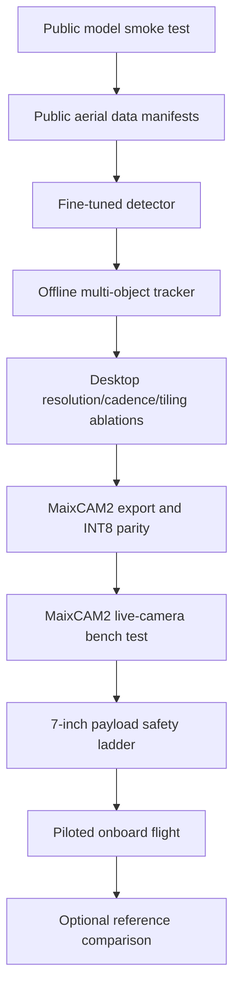

# µAeroTrack v1 implementation plan

This plan turns the v2 project brief into small, gated experiments. It is a plan,
not a claim that detection, tracking, device deployment, or flight has already
been completed.

## The shortest path to a working flight MVP



Each step produces an experiment record and has a stop/go gate. Later work does
not hide a failed earlier gate.

## Phase 0: freeze the foundation

**Status:** complete on 31 August 2026. The gate passes with checked-in schemas
and the full test, lint, and type-check suite.

**Purpose:** establish one precise foundation for all detection and tracking
work.

1. Add `configs/vocabulary_detection_v1.yaml` with the ten VisDrone names and
   stable IDs.
2. Add versioned `Detection`, `FrameDetections`, and `TrackObservation` models.
3. Define normalised `xyxy` boxes, monotonic timestamps, frame IDs, and stale
   rules once.
4. Add JSON Schemas and round-trip tests.
5. Create a v2 experiment-record template that adds model format, input size,
   precision, pipeline boundary, dataset split, and duration.

Suggested fields:

```text
Detection
  label_id, label, confidence
  bbox_norm_xyxy
  model_name, frame_id, captured_at_monotonic_ns

TrackObservation
  track_id, label_id, label, confidence
  bbox_norm_xyxy, velocity_norm_per_s
  age_frames, hits, time_since_update_frames
  frame_id, captured_at_monotonic_ns, stale
```

**Gate:** schemas are checked in, the full test suite passes, and tests reject
invalid boxes, unknown labels, duplicate IDs, and non-monotonic frame time.

## Phase 1: make the public model run before training

**Status:** implemented on 31 August 2026. The optional runtime, pinned model
identity, contract adapter, CLI, annotated tracked preview, ONNX validation, and
IoU parity report are checked in. The reproducible public-data smoke run is
recorded under `evaluation/experiments/exp_20260831_phase1_public_detector/`.

**Purpose:** prove the software path with the smallest possible investment.

1. Add an optional `detection` dependency group, keeping normal `uv sync`
   light.
2. Pin the detector package and the exact YOLO26n checkpoint hash.
3. Implement `detect_image`, `detect_video`, and a folder/video CLI.
4. Convert model output to the new project contract.
5. Run the untouched public model on ten small VisDrone fixtures and one short
   public video clip.
6. Save JSONL predictions, an annotated MP4, latency, and a few error frames.
7. Add ONNX export and compare PyTorch versus ONNX boxes after matching by IoU.

Use no custom CUDA kernels in this phase. A boring portable baseline is easier
to deploy and diagnose.

**Gate:** one command produces valid boxes and a tracked preview on CPU or GPU;
the ONNX model parses; parity differences are documented.

## Phase 2: assemble public aerial data

**Status:** VisDrone-DET and VisDrone-MOT (train+val) are complete on 31
August 2026, with real downloaded and converted data, disjoint-split
validation across all five manifests, cross-dataset duplicate detection, and
resize reports (see
`evaluation/experiments/exp_20260831_phase2_visdrone_det/`). That dedup run
found a real, upstream leak worth carrying into later phases: 30 duplicate
groups cross a DET/MOT train-eval split boundary (e.g. 22 DET-val images are
near-duplicates of 564 MOT-train frames) — not something to fix by altering
official splits, but something Phase 3/4 evaluation choices should account
for; see the experiment report for the full breakdown. VisDrone-VID and
UAVDT conversion/manifest code is implemented and unit-tested but has not run
against real data — UAVDT has no scriptable download source and VID was
skipped as redundant with MOT (same underlying video sequences); see
`data/README.md` for the manual-download path. The gate below is met for
VisDrone-DET and VisDrone-MOT; UAVDT remains the one gap.

**Purpose:** train on the camera geometry the system will actually encounter.

1. Download VisDrone-DET train and validation subsets through reproducible
   scripts.
2. Convert native annotations to the project schema and YOLO training format.
3. Preserve ignore regions, truncation, and occlusion metadata where available.
4. Download VisDrone-MOT/VID sequences for tracking evaluation.
5. Download UAVDT as a separate vehicle-domain test.
6. Store source URL, original ID, SHA-256, dimensions, sequence, frame number,
   and annotation conversion version in manifests.
7. Detect duplicate image hashes across DET, VID, and MOT before any split.
8. Keep official splits; where a split is needed, split whole sequences.
9. Generate class counts, box-area histograms, and examples at the intended
   640, 512, 416, and 320 input sizes.

Raw frames and weights remain outside Git. Small fixtures, scripts, manifests,
hashes, and reports are committed. Dataset licensing is not a development gate,
but provenance is retained.

**Gate:** every row validates, train/val/test sequence IDs are disjoint, and the
report shows how many targets become smaller than 4x4 and 8x8 pixels after each
resize.

## Phase 3: fine-tune the detector

**Status:** complete on 31 August 2026. The recorded fine-tuned checkpoint
beats the public YOLO26n baseline on the sequence-safe VisDrone score
(`mAP50-95` 0.1676 vs 0.0449, with AP-small improved for every native class); see
`evaluation/experiments/exp_20260831_phase3_visdrone_det/`.

**Purpose:** establish the aerial-domain detector before optimising hardware.

1. Start from the public COCO-pretrained YOLO26n weights.
2. Fine-tune at 640 with deterministic seeds and sequence-safe validation.
3. Preserve aspect ratio with letterboxing.
4. Use moderate geometric and colour augmentation; avoid transformations that
   create impossible aerial scenes.
5. Evaluate untouched COCO weights and fine-tuned weights with the same code.
6. Report `mAP50-95`, `AP_small`, recall, precision, and false positives per
   frame for each class.
7. Break results down by box pixel area, density, occlusion, and scene.
8. Save the best validation checkpoint and a separate last checkpoint by hash.
9. Inspect at least 25 false negatives and 25 false positives before changing
   the architecture.

If automatic batch-size profiling cannot complete on the target GPU, select and
record a fixed batch using a controlled one-epoch capacity probe. The selected
batch must complete without CUDA OOM retries; this changes the training policy,
not the architecture, classes, data split, or augmentation policy.

Start with native classes. Do not merge `pedestrian` and `person` until a report
shows that the benchmark distinction hurts the intended mission.

**Gate:** fine-tuning beats the untouched public checkpoint on VisDrone
`mAP50-95` and `AP_small`, without a catastrophic class collapse.

## Phase 4: add tracking offline

**Status:** complete on 31 August 2026. The sequence-separated VisDrone-MOT
experiment selected BoT-SORT with camera-motion compensation and ReID disabled
after a development-only comparison (HOTA 0.4136 vs ByteTrack 0.3566). Its
single held-out score was HOTA 0.4076 and IDF1 0.8591; see
`evaluation/experiments/exp_20260831_phase4_tracking/`.

**Purpose:** turn independent boxes into trajectories with stable IDs.

1. Run the detector on VisDrone-MOT validation sequences.
2. Add ByteTrack with all thresholds stored in config.
3. Tune only on a tracking-development subset, never the final held-out
   sequences.
4. Report HOTA, IDF1, identity switches, fragmentation, track recall, and
   detector latency separately from tracker latency.
5. Add a BoT-SORT configuration with ReID disabled and camera-motion
   compensation enabled.
6. Compare by camera-motion magnitude, object size, and occlusion.
7. Choose the simpler tracker unless the more complex one produces a material
   held-out improvement.

The output writer must retain the original frame time even if inference runs
late or skips a frame.

**Gate:** tracking produces stable IDs on held-out public video and the selected
tracker has a measured reason for winning. No hand-picked showcase sequence is
used as the score.

## Phase 5: find the efficient operating point

**Status:** planned. The pre-registered matrix and desktop utilities are
checked in under `configs/experiments/phase5_efficiency.yaml` and
`evaluation/experiments/exp_20260901_phase5_efficiency/`, but no Phase 5 run
or MaixCAM2 measurement has been completed.

**Purpose:** identify accuracy-qualified operating candidates without making
small targets disappear. This phase does **not** select the final onboard
profile: a desktop GPU cannot predict MaixCAM2 latency, power, thermals,
memory pressure, or export compatibility.

Use the desktop GPU only to measure detector/tracker quality trade-offs and to
discard clearly unacceptable configurations. In Phase 6, export the surviving
candidates and benchmark their complete pipeline on MaixCAM2. Only those target
measurements select the actual onboard quality and low-power profiles.

Run a controlled matrix using the same checkpoint and validation sequences:

| Variable | Values |
|---|---|
| input size | 640, 512/480, 416, 320 |
| precision | FP32 reference, FP16 where supported, INT8 |
| detector cadence | every frame, every 2nd, every 3rd frame |
| tiling | off, scheduled 2x2, uncertainty-triggered 2x2 |
| tracker | ByteTrack, selected moving-camera tracker |
| preview | off, on |

For skipped detector frames, propagate track state with the tracker's motion
model. Never present propagated boxes as fresh detections: record their age.

Tiling policy for the MVP:

- run the normal full-frame detector continuously;
- run an overlapping 2x2 scan at a low scheduled rate or when the scene has had
  no confident small-object detection for a configured interval;
- merge tile and full-frame boxes in original-image coordinates;
- measure the extra latency and power, not only accuracy.

**Gate:** retain a small set of candidates that meet the desktop
detection/tracking quality floor, with their quality trade-offs recorded. Do
not claim an onboard latency, power, or low-power winner until Phase 6 measures
the complete pipeline on the target hardware.

## Phase 6: export to the flight target

**Purpose:** export Phase 5's accuracy-qualified candidates to MaixCAM2 and
measure INT8 parity before committing to the live-camera pipeline.

1. Freeze the checkpoint, class order, and preprocessing for each candidate.
2. Export static batch-one ONNX with opset 17, `dynamic=False`, and the fixed
   selected input size.
3. Compile ONNX through Pulsar2 or MaixHub to a `.mud` and `.axmodel`, using
   20–100 representative aerial crops for INT8 calibration.
4. Compare desktop FP32, ONNX, and MaixCAM2 INT8 output on the same fixtures.
5. Match boxes by class and IoU; report score drift, missing boxes, extra boxes,
   and mAP loss after quantisation.
6. Adapt MaixPy detector objects into the existing Detection and FrameDetections
   contracts; retain the project BoT-SORT + CMC tracker with ReID disabled.
7. Pin MaixPy, Pulsar2/MaixHub, model, calibration set, and converter versions.

**Gate:** select the onboard quality and low-power profiles from true target
measurements; INT8 accuracy loss is understood, output contracts match, and
the MaixCAM2 device runs 1000 consecutive images without a leak or crash.

## Phase 7: build the live camera pipeline

**Purpose:** make the MaixCAM2 live-camera pipeline bounded and measurable.

Implement four bounded stages:

1. **Capture:** MaixCAM2 camera timestamps frames and writes only the newest
   frame into a one-slot queue.
2. **Inference:** preprocessing and accelerator execution consume the latest
   available frame.
3. **Tracking:** results update active tracks using the original capture time.
4. **Output:** JSONL logging is mandatory; preview/encoding is optional and may
   drop frames.

Add counters for capture frames, inferred frames, overwritten frames, tracker
updates, output frames, and errors. Use monotonic time for latency and UTC only
for human-readable session identity.

Run:

- a 60-second camera smoke test;
- a three-minute sustained test with preview off;
- a three-minute sustained test with the intended flight logging/streaming;
- a deliberately overloaded test proving queues stay bounded; and
- camera-disconnect and accelerator-error recovery tests.

**Gate:** at least 10 detector updates/s, p95 capture-to-track-result below
150 ms, bounded memory, and no thermal shutdown in the intended configuration.

## Phase 8: put it on the aircraft safely

**Purpose:** demonstrate MaixCAM2 onboard perception on a self-assembled
approximately 7-inch quadcopter without giving it control authority.

1. Finish and hover-tune the airframe with **no payload**.
2. Weigh the empty and payload-on aircraft and record centre-of-gravity shift.
3. Feed MaixCAM2 from the flight LiPo through its own fused 5 V BEC; do not
   share a thin flight-controller 5 V rail.
4. Fit an isolated nadir/belly mount clear of propeller disks.
5. Complete a powered props-off test with MaixCAM2 running.
6. Complete a restrained or prop-safe vibration test where locally permitted.
7. Verify RC, arming, failsafes, and return-to-home with the perception app
   running but with no control authority.
8. Run a short piloted hover with logging only.
9. Run an approximately three-minute piloted collection over a controlled scene
   with consenting people and vehicles.
10. Synchronise logs after landing and spot-annotate in-domain failures.

Do not stream high-bitrate video unless it is needed for supervision. Do not
connect perception output to guided modes in this phase.

**Gate:** the system performs inference onboard for the full flight, logs are
complete, aircraft behaviour remains normal, and detections/tracks can be
verified against the recorded camera stream.

## Phase 9: optional reference-platform comparison

**Purpose:** compare the completed MaixCAM2 flight target with a Pi/Hailo,
Luckfox, or desktop INT8 reference only if that comparison answers a new
question. It is not a flight-MVP gate.

1. Repeat the exact validation clips and full-pipeline measurements on an
   optional reference platform.
2. Compare MaixCAM2 with Pi/Hailo, Luckfox, or desktop/Jetson as applicable on:
   accuracy, HOTA/IDF1, p95 latency, power, mass, cost, temperature, and setup
   effort.
3. Report capability gained or lost per dollar, watt, and gram.

**Gate:** no gate for the flight MVP; retain the comparison only if its protocol
and platform differences are explicit.

## Test plan

Unit tests cover box normalisation, class mapping, timestamp monotonicity,
staleness, track lifecycle, tile coordinate restoration, box merging, manifest
validation, and deterministic configuration hashes.

Integration tests cover:

- public checkpoint download/hash and one-image inference;
- PyTorch to ONNX parity;
- ONNX/MaixCAM2 `.axmodel` parity;
- sequence reader to detection to tracker to JSONL;
- bounded-queue behaviour under overload;
- process restart and partial-log recovery; and
- a small checked-in video fixture with deterministic expected invariants.

Evaluation tests never assert an exact research metric in unit CI. They validate
that expected classes, counts, timing fields, and metric files exist and are
finite.

## Experiment sequence

Use these names when work begins; the actual date replaces `YYYYMMDD`:

1. `exp_YYYYMMDD_yolo26n_public_smoke`
2. `exp_YYYYMMDD_visdrone_yolo26n_640`
3. `exp_YYYYMMDD_tracker_baselines`
4. `exp_YYYYMMDD_resolution_cadence_tiles`
5. `exp_YYYYMMDD_maixcam2_axmodel_parity`
6. `exp_YYYYMMDD_maixcam2_live_camera_sustained`
7. `exp_YYYYMMDD_7inch_onboard_flight_v1`
8. `exp_YYYYMMDD_reference_hailo_or_desktop`

## Stop conditions

- If YOLO26n cannot compile through Pulsar2/MaixHub after three documented
  attempts, switch to YOLO11n at the same input sizes rather than rewriting the
  runtime around a broken compile.
- If 640-pixel inference misses the speed floor, reduce detector cadence before
  reducing resolution; tiny-object information is expensive to recover after
  it is discarded.
- If INT8 causes unacceptable small-object loss, try better representative
  calibration and quantisation-aware training before changing hardware.
- If the payload, mount, or dedicated power system degrades stable manual
  flight, stop flight work and change the aircraft or payload.
- If tracking metrics are poor but detection is sound, diagnose camera motion
  and association thresholds before training another detector.

## Definition of done

The project is not done when a training graph looks good. It is done when a
reproducible public-data detector and tracker execute on the aircraft's onboard
computer during a real piloted flight, with recorded evidence for accuracy,
track stability, latency, power, mass, temperature, and cost.
