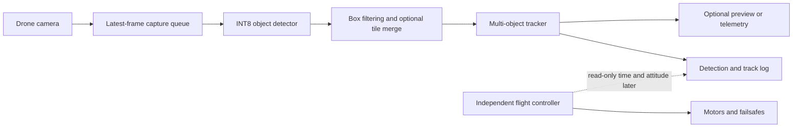

# Project brief v2: low-cost aerial detection and tracking

**Working name:** µAeroTrack  
**Status:** Phase 0 foundation complete; public detector work is next
**Date:** 31 August 2026  

## One-sentence brief

Build and measure the cheapest practical onboard system that can detect and
maintain identities for common objects in aerial video, in real time, while a
drone is flying.

## The problem

A useful onboard drone perception system must:

- find every relevant object, not merely name the whole image;
- return a bounding box showing where each object is;
- keep a stable identity for an object as the camera and object move;
- run continuously within a measured power, mass, heat, and latency budget;
- fail without affecting the flight controller.

The project measures whether those capabilities can run within a low-cost
payload's compute, power, mass, heat, and latency limits.

## The MVP

The MVP takes live or recorded camera frames and emits a list of tracked
objects. Each result contains a class, confidence, normalised bounding box,
track ID, age, and last-seen time. It draws an optional preview and saves a
machine-readable log.

The first supported classes are the ten native VisDrone categories:

1. pedestrian
2. person
3. bicycle
4. car
5. van
6. truck
7. tricycle
8. awning-tricycle
9. bus
10. motor

These names are versioned as `vocabulary_detection_v1` so datasets, models,
runtime outputs, and metrics always use the same class order.

The first flight demonstration is intentionally simple: a pilot flies the
aircraft while the onboard computer detects and tracks objects, records its
outputs, and optionally sends a low-rate preview to the ground. It does not
steer the aircraft.

## What “works” means

The MVP is complete only when all of these are true:

- A public pretrained model runs end to end on a normal computer and produces
  valid boxes on sample aerial video.
- A detector fine-tuned on public aerial data beats the untouched public model
  on a sequence-separated VisDrone validation set.
- Detection and multi-object tracking run on the selected onboard computer
  from the real camera, without a desktop in the loop.
- The onboard pipeline sustains at least 10 detector updates per second at its
  selected input size, with p95 capture-to-result latency below 150 ms.
- A three-minute powered bench run and a three-minute piloted flight complete
  without a process crash, out-of-memory event, or thermal shutdown.
- The flight log contains frame timestamps, detections, track IDs, latency,
  dropped-frame counts, temperature, and power measurements.
- A held-out aerial-video report contains detection accuracy, small-object
  accuracy, tracking accuracy, per-class failures, latency, power, mass, and
  total hardware cost.

The numerical speed gates are MVP floors, not claims about safety or autonomous
flight.

## System boundary

The perception computer is a companion payload. Arming, stabilisation, pilot
override, return-to-home, and motor outputs remain entirely inside the normal
flight controller. The first MVP has no perception-to-flight-control command
path.

## Chosen technical baseline

### Detector

Start with a nano-sized public YOLO checkpoint, currently **YOLO26n**, and
fine-tune it on VisDrone at 640 pixels. It is chosen because the current public
toolchain supports training, tracking, ONNX export, Hailo export, INT8
calibration, and an end-to-end output format. The exact package and checkpoint
hash will be pinned because these interfaces change.

If YOLO26n cannot compile or meet accuracy on the selected Hailo runtime,
YOLO11n is the compatibility fallback. A more specialised research detector is
an ablation, not a prerequisite for the MVP.

### Tracker

Use ByteTrack for the first offline baseline. It is cheap because it associates
boxes using motion and detection confidence rather than running a second visual
identity network. Its use of lower-confidence detections can recover partially
occluded objects that would otherwise break a trajectory.

For actual moving-camera footage, compare BoT-SORT with appearance matching
disabled and camera-motion compensation enabled. Drone motion violates the
fixed-camera assumption: the whole background can translate or rotate even
when an object is stationary. Appearance re-identification is deferred because
it adds another neural network and a significant compute cost.

### Edge hardware

The **working flight target** is a Raspberry Pi 5 with a Hailo-8L-class AI
accelerator, a CSI camera, storage, and a regulated 5 V supply. This is not the
absolute cheapest board. It is the cheapest current route with a mature public
camera pipeline, supported model exports, precompiled models, tiling examples,
and enough community evidence to make “must work” credible.

The **cost-down candidate** is MaixCAM2. It integrates a camera interface,
Linux, hardware video codecs, and a vendor-rated 3.2 TOPS INT8 accelerator in a
small package. The vendor reports high YOLO11n throughput, but that is a
model-only vendor benchmark and does not establish our full aerial pipeline.
Availability and model-conversion maturity make it a second target, not the
critical path.

An NVIDIA Jetson is an optional upper-bound reference only. The ESP32-P4 is no
longer the deployment target; it can remain a later extreme-compression
experiment.

## Public data and public models

The project will use public assets aggressively and keep their original IDs and
source URLs. Licence review is not an MVP gate, as requested. Provenance will
still be recorded so a later public release can audit what may be redistributed.

- **VisDrone-DET** supplies aerial still images and boxes for detector training
  and validation.
- **VisDrone-MOT/VID** supplies sequences and identities for tracking and
  moving-camera evaluation.
- **UAVDT** supplies a second aerial domain with vehicles, altitude, view,
  weather, and occlusion attributes.
- **COCO-pretrained YOLO weights** provide the initial visual features instead
  of training from random weights.
- **Hailo Model Zoo artefacts** provide known-good conversion and runtime
  references where a matching network is available.
- A small amount of footage from the actual camera and lens is reserved for the
  final domain test. It is never mixed into the public validation score.

Dataset splits are by video sequence or source scene. Adjacent frames from one
flight must never be divided between training and evaluation.

## Efficiency strategy

The MVP applies optimisations in an evidence-first order:

1. Use the smallest supported detector and batch size one.
2. Keep only the newest camera frame, so latency cannot grow behind a queue.
3. Use hardware-native capture and avoid unnecessary image copies.
4. Compile to the accelerator's native INT8 format with representative aerial
   calibration images.
5. Measure 640 and 512/480/416/320 input sizes instead of assuming 640 is best.
6. Run the detector at a measured rate and use a Kalman tracker to maintain
   tracks between detector updates.
7. Test scheduled or uncertainty-triggered 2x2 sliced inference for tiny
   objects, rather than tiling every frame.
8. Add camera-motion compensation only if it materially improves track
   continuity.
9. Disable preview rendering and video encoding during final latency/power
   measurements unless they are part of the mission.
10. Distil or modify the architecture only after the plain public baseline has
    a measured bottleneck.

This order follows the research without turning the MVP into a paper-replication
project. YOLOv10 showed that removing redundant post-processing can improve the
latency/accuracy trade-off. SAHI showed substantial aerial small-object gains
from sliced inference, but slicing multiplies work. ByteTrack showed the value
of retaining low-confidence boxes, while BoT-SORT showed why camera-motion
compensation matters. Recent aerial detectors such as EDNet add tiny-object
heads and cross-scale fusion, but these become candidates only if the supported
baseline misses the accuracy gate.

## Measurements

Detection is measured with COCO-style `mAP50-95`, `AP_small`, recall by class,
and false positives per frame. Tracking is measured with HOTA, IDF1, identity
switches, fragmentation, and track recall. The system report also records:

- capture-to-result latency p50 and p95;
- sustained detector updates per second and camera frames per second;
- dropped and overwritten frames;
- accelerator, CPU, and memory use where available;
- average and peak electrical power;
- steady-state temperature and throttling;
- model and runtime storage size;
- payload mass; and
- complete onboard-compute cost.

No single “FPS” number is accepted without its input size, precision, full
pipeline boundary, and test duration.

## Main risks and deliberate compromises

- **Tiny objects:** reducing input size saves compute but can erase the object.
  The project reports results by object pixel area and tests selective tiling.
- **Camera motion:** a normal tracker can confuse camera movement with object
  movement. BoT-SORT-style motion compensation is the planned remedy.
- **Motion blur and vibration:** public datasets cannot reproduce the exact
  propeller vibration, shutter, lens, and mounting. A short real-camera test is
  mandatory.
- **Thermals and power:** desktop speed does not predict sustained flight
  speed. The three-minute bench and flight runs are acceptance gates.
- **Public benchmark overfitting:** VisDrone is the development domain; UAVDT
  and real footage expose cross-domain failure.
- **Scope creep:** no segmentation, language prompting, autonomous following,
  mapping, or collision avoidance is needed for v1.

## Not in the MVP

- autonomous navigation or target following;
- face recognition, identity recognition, or person re-identification;
- open-vocabulary or text-prompted detection;
- a custom detector architecture;
- a new dataset annotation campaign;
- event cameras, thermal cameras, or multiple cameras;
- training onboard; or
- changes to flight-controller firmware.

## Research and implementation references

- [VisDrone official dataset repository](https://github.com/VisDrone/VisDrone-Dataset)
- [UAVDT official benchmark](https://sites.google.com/view/grli-uavdt/)
- [YOLOv10: Real-Time End-to-End Object Detection](https://arxiv.org/abs/2405.14458)
- [SAHI: Slicing Aided Hyper Inference](https://arxiv.org/abs/2202.06934)
- [ByteTrack](https://arxiv.org/abs/2110.06864)
- [BoT-SORT](https://arxiv.org/abs/2206.14651)
- [EDNet: edge-optimised UAV small-target detection](https://arxiv.org/abs/2501.05885)
- [Ultralytics tracking documentation](https://docs.ultralytics.com/modes/track/)
- [Ultralytics export and quantisation documentation](https://docs.ultralytics.com/modes/export/)
- [Hailo applications and camera pipelines](https://github.com/hailo-ai/hailo-apps)
- [Hailo Model Zoo](https://github.com/hailo-ai/hailo_model_zoo)
- [MaixCAM2 official specifications](https://wiki.sipeed.com/hardware/en/maixcam/maixcam2.html)
